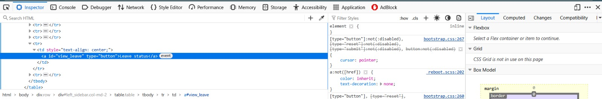
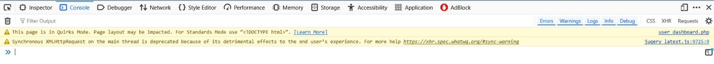

## Group 3 : Bibechana Bhandari | Aslam Shaikh | Sabrina mustafa

# Task Management System (TMS) - Project Documentation

## 1. Project Overview

### 1.1 Purpose
The Task Management System (TMS) is a web-based application designed to streamline task assignment, tracking, and leave management within an organization. It supports multiple user roles (Admin, Team Lead, and User) to facilitate efficient workflow management, ensuring tasks are assigned, monitored, and completed effectively while allowing employees to request and track leaves.

### 1.2 Objectives
- Enable administrators to manage users and oversee system operations.
- Allow team leads to create and assign tasks to team members.
- Provide users with tools to update task statuses and apply for leaves.
- Ensure secure access through role-based authentication.
- Maintain a centralized database for tasks, leaves, and user information.

### 1.3 Scope
The TMS caters to small to medium-sized teams, offering:
- User management (Admin).
- Task creation, assignment, and status tracking (Admin and Team Leads).
- Leave request and approval system (Users and Team Leads).
- Dashboard views tailored to each role.

---

## 2. System Features

### 2.1 User Roles and Functionalities
1. **Admin**
   - Login and manage user accounts.
   - Create tasks with priority levels (Normal/Urgent).
   - View all tasks and user activities.
  
  

1. **Team Lead**
   - Create and assign tasks to team members.
   - Monitor team tasks and update statuses.
   - Apply for leaves and check leave status.
  
  .png>)

2. **User**
   - View and update assigned task statuses (Not Started, In Progress, Complete).
   - Apply for leaves and view leave statuses (No Action, Approved, Rejected).
  
  .png>)

### 2.2 Key Features
- **Task Management**
  - Task creation with description, start/end dates, and priority.
  - Task status updates with validation.
  - Priority-based sorting and visual cues (e.g., red background for urgent tasks).

- **Leave Management**
  - Leave request submission with subject and message.
  - Leave status tracking.
- **Role-Based Access Control**
  - Session-based authentication with role verification.
- **Dynamic Dashboard**
  - AJAX-driven content loading using jQuery for seamless navigation.

.png>)

---

## 3. System Architecture

### 3.1 Technology Stack
- **Frontend**
  - **HTML**: Structure of web pages.
  - **CSS**: Custom styling (e.g., `style.css`).
  - **Bootstrap**: Responsive design and UI components.
- **Backend**
  - **PHP**: Server-side logic and database interactions.
  - **JavaScript/jQuery**: Dynamic content loading and client-side interactivity.
  - **MySQL**: Relational database for storing user, task, and leave data.
- **Tools**
  - **phpMyAdmin**: Database management.
  - **Font Awesome**: Icons for enhanced UI.

### 3.2 Database Schema
The system uses a MySQL database (`tms_db`) with the following tables:
1. **`admins`**
   - **Fields**: `id`, `name`, `email`, `password`, `mobile`
   - **Purpose**: Stores admin credentials.
2. **`users`**
   - **Fields**: `uid`, `name`, `email`, `password`, `mobile`, `role`
   - **Purpose**: Stores user and team lead details with role differentiation.
3. **`tasks`**
   - **Fields**: `tid`, `uid`, `description`, `start_date`, `end_date`, `status`, `priority`, `created_by`
   - **Purpose**: Tracks tasks with assignment and status details.
4. **`leaves`**
   - **Fields**: `lid`, `uid`, `subject`, `message`, `status`
   - **Purpose**: Manages leave requests and their statuses.

### 3.3 File Structure
- **Root Directory**
  - `index.php`: Entry point with login options.
  - `user_login.php`: User/Team Lead login page.
  - `teamlead_dashboard.php`: Team Lead dashboard.
  - `user_dashboard.php`: User dashboard.
  - `update_status.php`: Task status update form.
  - `logout.php`: Session termination script.
- **Includes**
  - `connection.php`: Database connection logic.
- **CSS**
  - `style.css`: Custom styles.
- **Bootstrap**: External CSS/JS files for styling and functionality.

### 3.4 Access Control & Authentication Logic

The system uses session-based authentication and role-based access control to manage users securely:

- `session_start()` is used in all protected pages.
- `$_SESSION['role']` is used to redirect users based on their assigned roles.
- Admin, Team Lead, and User dashboards are accessible only after login validation.

---

## 4. System Workflow

1. **User Authentication**
   - Users log in via `user_login.php`, which checks credentials against the `users` table.
   - Role-based redirection to appropriate dashboards (`teamlead_dashboard.php` or `user_dashboard.php`).

2. **Task Management**
   - Admins create tasks via a form, stored in the `tasks` table.
   - Team Leads assign tasks to users, with priority and date validation.
   - Users update task statuses via `update_status.php`.

3. **Leave Management**
   - Users/Team Leads submit leave requests via forms, stored in the `leaves` table.
   - Status updates (e.g., Approved/Rejected) are managed by admins (not implemented in provided code).

4. **Dynamic Navigation**
   - jQuery loads content (e.g., `task.php`, `leaveForm.php`) into the right sidebar without page reloads.

---

## 5. Security Considerations

- **Authentication**: Session-based with role checks.
- **Input Sanitization**: Uses `mysqli_real_escape_string` and prepared statements to prevent SQL injection.
- **Data Display**: HTML escaping (`htmlspecialchars`) to prevent XSS.
- **Weaknesses**: 
  - Root database access with no password in `connection.php`.
  - Inconsistent use of prepared statements across files.

### Recommendations
- Use parameterized queries consistently.
- Implement password hashing (e.g., `password_hash`).
- Secure database credentials with environment variables.

---

## 6. Installation and Setup

### 6.1 Prerequisites
- PHP 8.1.6 or higher.
- MySQL/MariaDB (e.g., 10.4.24-MariaDB).
- Web server (e.g., Apache).
- phpMyAdmin (optional).

### 6.2 Steps
1. **Database Setup**
   - Import the SQL dump (`tms_db.sql`) into MySQL using phpMyAdmin or CLI.
   - Update `connection.php` with your database credentials.
2. **File Deployment**
   - Place files in your web server’s root directory (e.g., `htdocs` for XAMPP).
   - Ensure `includes` and `css` folders are accessible.
3. **Access**
   - Navigate to `http://localhost/dgl104-appdevproj-group3/` in a browser.
   - Use default admin credentials: `admin@gmail.com` / `admin@123`.

---

## 7. Debugging

---

## 8. Conclusion

The Task Management System provides a robust foundation for managing tasks and leaves within a team. While functional, it can benefit from enhanced security measures and additional features to improve usability and scalability. This documentation serves as a guide for developers and stakeholders to understand, deploy, and extend the system.

## Citation
CSEtutorials. (2023, December 10). Task Management System Project in PHP and MySQL With Source Code || PHP Project ||  [Video]. YouTube. https://youtu.be/gVGaSIrFdfY
